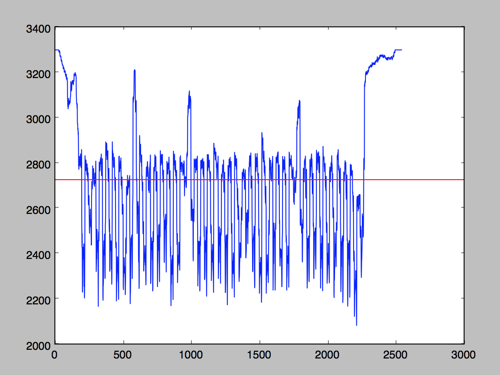
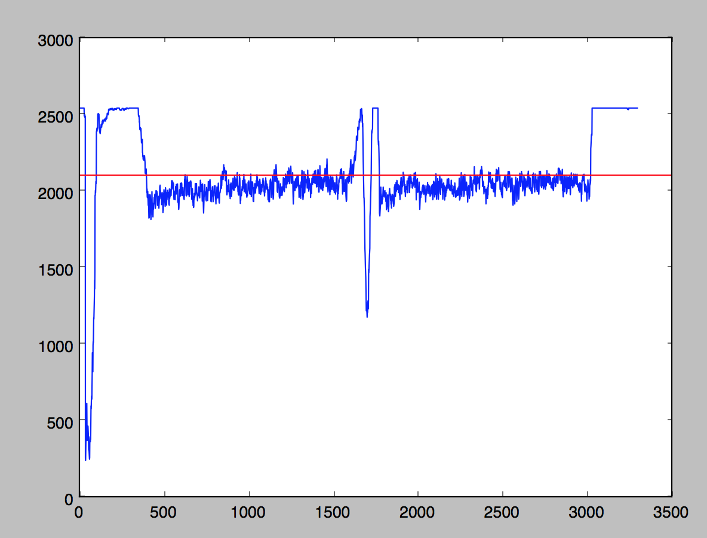

# The PDF Project 

*For Software Construction Fall 2014*

Catherine Moresco, Jonathan Jin, Megan Barnes, Michael Zhao, Alberto Rios, and Cristian Saucedo

## Update 11/19/14: Iteration 2 Plans
Features to be included:

##### UI:
- Highlights!
- Annotations!
- Deleting highlights and annotations!
- Some fine-looking front-end desgin!

##### Server:
- Modified PDF document download!
	+ Getting highlight data from frontend
	+ Merging highlights and SVG edits
- Streamlined file handling!

##### Image processing:
- Refined image processing algorithms!
	 + Better skew detection accuracy
	 + Enhanced handling of noise and blacked-out margins
- Eliminate ImageMagick dependency!
	+ Require Ghostscript instead, which has a much simpler installation process.

##### Overall: 
- Opportunities for user correction of algorithmic failings!

## Features

Features successfully implemented in this iteration include:
- File uploading
- Exporting PDF pages to JPG images
- Image processing
	+ Skew detection and correction
	+ Extraction of text line coordinates
- Image display

## Example Usage and Recommended Acceptance Tests
It's pretty simple to use: upload your own document with the "upload" button, and watch it appear---processed and straightened!

The best images are ones that are well formed, and have only one page of text per PDF page. Images imbedded in the text are OK!

## Dependencies
Install python packages with `pip install -r <path/to/requirements.txt>`.

Third party packages (see respective websites for installation instructions):

- [OpenCV2](http://opencv.org/)
- [Ghostscript](http://ghostscript.com/doc/current/Install.htm)

## How to Run
After installing dependencies, you can run the app locally with `python runserver.py`.

For automatic server-crash recovery, install supervisord and start the server using `run.sh`.

## How to Run Unit Tests
#####Image Processing Tests:
From within tests/cvtests, run the command `python -m unittest -v cv_unit_tests`.

The folder 'cvtests' contains the test file and copies of source files for our image processing algorithms.  More specific information about which functions and what functionality the tests are concerned with is within 'cv_unit_tests.py'.

*- Megan and Catherine*

##### UI Tests:
 The unit tests that we initially submitted will not run given the changes in our UI desgin.We are researching automated processes for testing UI that will be incorporated into Iteration 2.

 1. Run the app locally with `python runserver.py`
 2. Run the individual test suites with `python tests/uitests/<suite_name>`

 *- Alberto and Cristian*

## Who did What
### Alberto & Cristian: 
We were in charge of User Interface design. We created the HTML displayed, worked on uploading files to server, passing files to CV modules, and displaying the resulting files.

### Catherine & Megan: 
We were in charge of the Computer Vision aspect of the project, which had several challenging aspects.

##### PDF Rasterizing
We put a lot of research into pre-existing PDF rendering software; while PDF itself is not a proprietary format, PDF documents cannot be rasterized for image processing with any software written in pure Python. We began with a Python library that provides Python bindings for the ImageMagick software suite. 

PythonMagick has several downsides: 
- It is incredibly difficult to install.
- It is slow. 
- It is virtually undocumented.

In exploring other options, I learned that ImageMagick itself uses another sortware suite, Ghostscript, for PDF rendering. Ghostscript does not have Python bindings, so we make a call to it via a subprocess and pipe the raw output into a buffer variable, and then parse the resulting bytestream to extract the JPGs.

(This whole process was so traumatic that [Catherine blogged about it](http://catmores.co/cv/pdf/2014/11/13/teaching-my-computer-to-read-pdfs-are-evil.html). [Twice](http://catmores.co/pdf/2014/11/19/teaching-my-computer-to-read-not-good-enough.html).)

##### Skew Detection

We also did a lot of research into pre-existing line detecting and skew correcting algorithms. Our line detection algorithm relies upon use of horizontal line filters, so it is best if the lines are as straight across as possible when the line detection algorithm is applied. Some document analysis strategies involve identifying lines first, and then correcting for skew; many of these involve ridge detection and much more mathematically complex operations than we would like to implement, in the interest of being able to complete the image processing in a reasonable amount of time. We assume that the text lines are largely straight, as our software is intended for scanned images; [handling of curled lines](http://link.springer.com/chapter/10.1007%2F978-3-642-03767-2_21), while a worthwhile and interesting feature to implement in the future, is not necessary for the essential functionality of our application.

The skew detection algorithm that we arrived at is efficient and reasonably robust. It involves iterating through a range of rotation angles, and finding the one that maximizes the variation of the sums of pixel values across a row. *Why* this works can be explained by the following graphs:

### Michael Zhao
Set up the server.

### Jonathan Jin
Taking on QA and test coverage responsibilities for the front-end tests. Designed the preliminary front-end testing framework that, as of 11/19/14, comprises the primary front-end test suite.

## Evolution
One of the major ways in which our current implementation differs from our initial design is the architecture and design portion of the backend. We designed a somewhat elaborate class diagram to structure our document data. Once we started writing code, however, we realized that the PDF data would best be handled by a pipe-and-filter architecture, and so our approach became more functional, implementing no Python classes at all.

