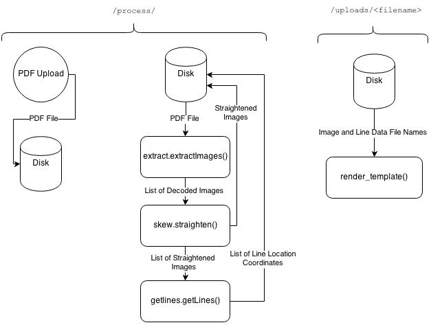
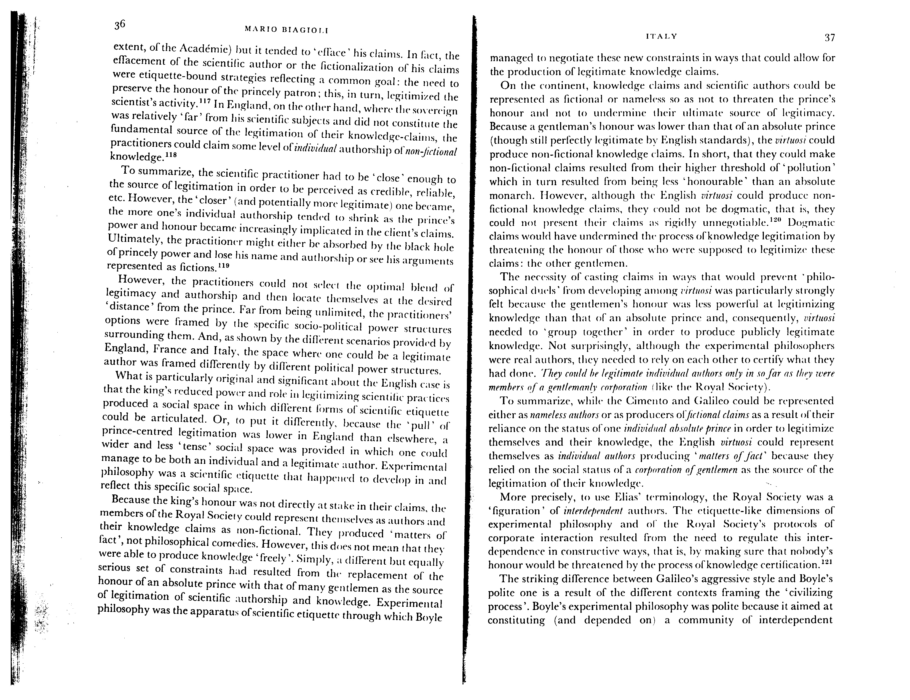
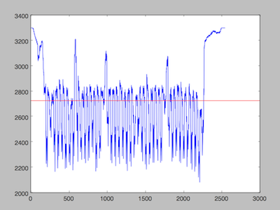
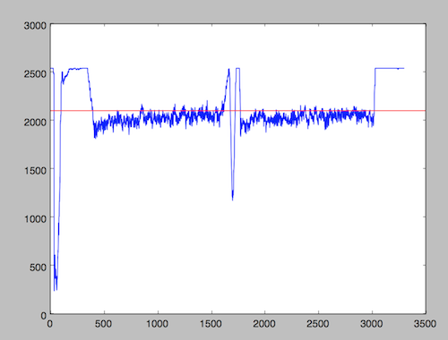
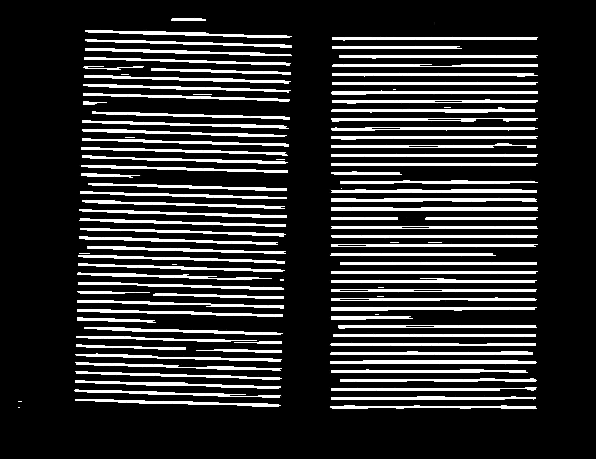
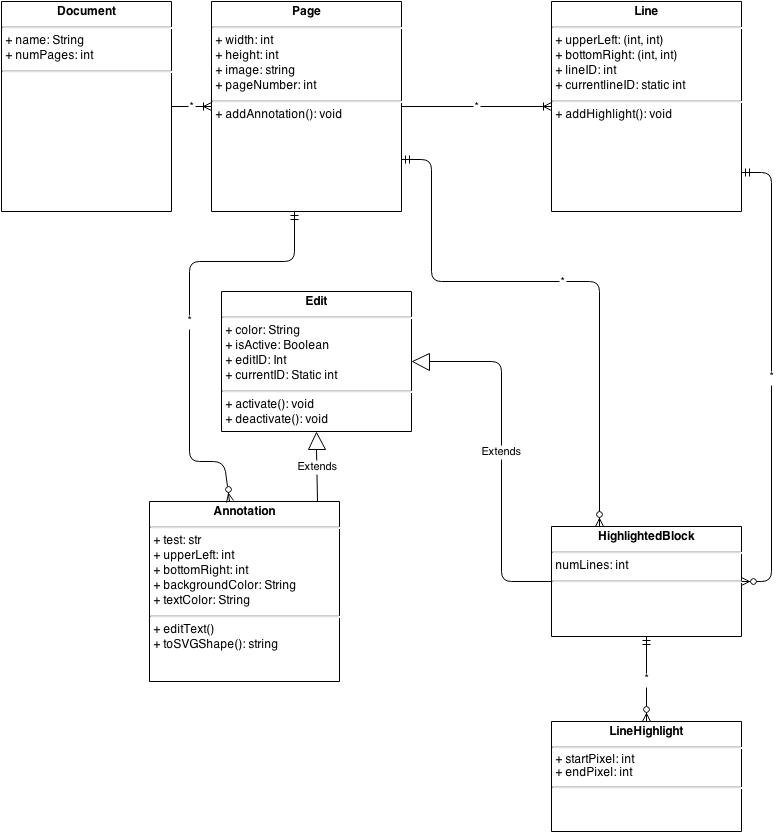

# The PDF Project 

*For Software Construction Fall 2014*

Catherine Moresco, Jonathan Jin, Megan Barnes, Michael Zhao, Alberto Rios, and Cristian Saucedo

## Update 11/19/14: Iteration 2 Plans
Features to be included:

##### UI:
- [x] Highlights!
- [ ] Annotations!
- [x] Deleting highlights and annotations!
- [x] Some fine-looking front-end desgin!

##### Server:
- [ ] Modified PDF document download!
	+ Getting highlight data from frontend
	+ Merging highlights and SVG edits
- [x] Streamlined file handling!

##### Image processing:
- [x] Refined image processing algorithms!
	 + Better skew detection accuracy
	 + Enhanced handling of noise and blacked-out margins
- [x] Eliminate ImageMagick dependency!
	+ Require Ghostscript instead, which has a much simpler installation process.

##### Overall: 
- [ ] Opportunities for user correction of algorithmic failings!

## Features Not Actually Included in Iteration 2

Highlights work, but do not follow the detected lines of the text. Annotations didn't work. A function was created for PDF download, but no interface to it was provided, nor was opportunity for user corrections provided.

The line highlighting was difficult because keeping track of dynamic boxes along with deleting dynamic boxes and choosing which boxes where kept according to event listeners was a task of unexpected complexity.

Overall, the lack of these features was largely sure to an underestimation of their difficulty and a lack of appropriately allotted amounts of time on the parts of the responsible teams.


## Example Usage and Recommended Acceptance Tests
It's pretty simple to use: upload your own document with the "upload" button, and watch it appear, processed and straightened!

The best images are ones that are well formed, and have only one page of text per PDF page. Images imbedded in the text are OK!

Don't have your own document? That's okay! There's a sample PDF document in `/tests` called "tryme.pdf". Try uploading it for a demonstration of skew correction and line detection!


## Dependencies
Install python packages with `pip install -r <path/to/requirements.txt>`.

Third party packages (see respective websites for installation instructions):

- [OpenCV2](http://opencv.org/)
- [Ghostscript](http://ghostscript.com/doc/current/Install.htm)

## How to Run
After installing dependencies, you can run the app locally with `python runserver.py`.

For automatic server-crash recovery, install supervisord and start the server using `run.sh`.

## How to Run Unit Tests
#####Image Processing Tests:
From within tests/cvtests, run the command `python -m unittest -v cv_unit_tests`.

The folder 'cvtests' contains the test file and copies of source files for our image processing algorithms.  More specific information about which functions and what functionality the tests are concerned with is within 'cv_unit_tests.py'.

*- Megan and Catherine*

##### UI Tests:
 The unit tests that we initially submitted will not run given the changes in our UI desgin.We are researching automated processes for testing UI that will be incorporated into Iteration 2.

 1. Run the app locally with `python runserver.py`
 2. Run the individual test suites with `python tests/uitests/<suite_name>`

 *- Alberto and Cristian*

## Program Structure (Step-by-step)
1. Our web app contains the initial functionality for uploading a PDF.  The app's code can be found in pdfproject/_init_.py, with functions to handle the home screen, as well as uploading.  The content/styling/javascript functions for the app's pages can be found within pdfproject/templates and pdfproject/static.
2. Once the user has chosen a PDF to upload, the upload_file() function in _init_.py saves the file to the uploads folder on the server
3. upload_file() then calls processing.process() from pdfproject/processing.py on the PDF file to initialize image processing
	1. process() first calls extract.extractImages() from pdfproject/extract.py in order to pull images (.jpg) representing each page of the PDF from the file.  These will be passed to the rest of the image processing functions.
	2. process() calls skew.straighten() (from pdfproject/skew.py) on each of the images, which first uses skew.horizontal_sums() to help calculate the probable skew angle of the input image and then skew.rotate() to generate an image rotated at that angle.  It returns a rotated image for every input image.
	2. process() calls getlines.getLines() on each straightened image.  getLines() calls its helper function, getlines.isolateLines() which contains the entire algorithm for creating a grayscale image which has black where blank space should be and white where it thinks there are text lines.  getLines() then detects the pixel coordinates of the lines and returns them in a list.
4. processing.process() gathers the lines and puts them in a dictionary, mapped to their page number as a key.  The dictionary is returned as a json string.
5. Passing the json string back to the web app as a ....json.txt file, upload_file() in _init_.py redirects to a page which corresponds to the uploaded_file() function in _init_.py, which displays each of the processed images that were returned after straightening and reads the line coordinates for highlighting from the ....json.txt file.  The page is once again rendered using html/css/javascript from pdfproject/templates and pdfproject/static.
6. Annotations are rendered as SVG objects on the page.
7. The user will be able to export their annotations. We use Javascript libraries, in particular jsPDF, to keep this processing on the client side.

### Data Flow Diagram
A data flow diagram for our backend processes is provided below.



Our architecture resembles a hybrid between a pipe-and-filter and data-centered architecture. A pipe-and-filter architecture makes sense for our task, because image processing consists mostly of passing the PDF and image data through a series of filter that modifies said data and extracts needed information. Writing to and reading from memory is necessitated by our choice to implement our software as a web application; it is the method most suited to passing file data from one app route to the next. 

### File Structure

Confused about where a particular part of the project is implemented? Look no further! 

Following is a diagram of the organizational structure of the code:

```
/pdfproject
	/pdfproject						
		/static
			/uploads
			/css
				/images
					[image assets]
				/svg
					[svg image assets]
				[css and scss files]	
			/js
				[JavaScript files]  		<- front-end scripts
		/templates
			[HTML templates for page rendering]
		[image processing modules]			<- image processing scripts
		__init__.py 						<- main server file
	/tests
		/cvtests
			/testimg
				[images used for testing]
			[image processing modules]
			cv_unit_tests.py 				<- image processing testing script
		/uitests
			annotation_tests.py 			<- UI unit testing scripts
			highlight_tests.py
			upload_tests.py
	/readme-assets
		[images used in readme file]
	.gitignore
	README.md 								<- readme (YOU ARE HERE)
	pdfproject.log
	requirements.txt 						<- requirements
	run.sh
	runserver.py 							<- script to run locally
	supervisord.conf
```

## Who Did What
### Alberto: 
In charge of User Interface design. Created the HTML displayed, worked on uploading files to server, passing files to CV modules, displaying the resulting files, drawing SVG highlights.

### Catherine & Megan: 
We were in charge of the Computer Vision aspect of the project, which had several challenging aspects.

#### PDF Rasterizing
We put a lot of research into pre-existing PDF rendering software; while PDF itself is not a proprietary format, PDF documents cannot be rasterized for image processing with any software written in pure Python. We began with a Python library that provides Python bindings for the ImageMagick software suite. 

PythonMagick has several downsides: 
- It is incredibly difficult to install.
- It is slow. 
- It is virtually undocumented.

In exploring other options, I learned that ImageMagick itself uses another software suite, Ghostscript, for PDF rendering. Ghostscript does not have Python bindings, so we make a call to it via a subprocess and pipe the raw output into a buffer variable, and then parse the resulting bytestream to extract the JPGs.

(This whole process was so traumatic that [Catherine blogged about it](http://catmores.co/cv/pdf/2014/11/13/teaching-my-computer-to-read-pdfs-are-evil.html). [Twice](http://catmores.co/pdf/2014/11/19/teaching-my-computer-to-read-not-good-enough.html).)

#### Skew Detection

We also did a lot of research into pre-existing line detecting and skew correcting algorithms. Our line detection algorithm relies upon use of horizontal line filters, so it is best if the lines are as straight across as possible when the line detection algorithm is applied. Some document analysis strategies involve identifying lines first, and then correcting for skew; many of these involve ridge detection and much more mathematically complex operations than we would like to implement, in the interest of being able to complete the image processing in a reasonable amount of time. We assume that the text lines are largely straight, as our software is intended for scanned images; [handling of curled lines](http://link.springer.com/chapter/10.1007%2F978-3-642-03767-2_21), for example, while a worthwhile and interesting feature to implement in the future, is not necessary for the essential functionality of our application.

The skew detection algorithm that I arrived at is efficient and reasonably robust. It involves iterating through a range of rotation angles, and finding the one that maximizes the variation of the sums of pixel values across a row. *Why* this works can be explained by looking at the following image:



And the following graphs, which correspond to the sums of its rows and columns. A sum will be zero is every pixel in the row is black, and it will be at it's maximum when every pixel in the row is white.

##### Rows

##### Columns



In each, the red line represents the mean value, and the blue represents the sums. The rows show dramatic, evently-spaced peaks which correspond to the text lines and the white space between them; the white spaces are the maxima, and the pixel rows that follow the lines of text are the minima. The column graph shows fluctuation, but stay much closer to the mean value, with major peaks only at the margins. To find where the text is the straightest, we want the horizontal sums to resemble the first of these graphs as closely as possible: with dramatic, evenly spaced peaks. We initially used standard deviation as a measure of optimal rotation, but through experimentation we learned that variance was a better metric; extreme outliers, such as those at the margins in the column graph (seen in the image page itself as the dark lines in the margins), can skew the standard deviation more than is desired. 


#### Get Text Lines

This is arguably the hardest of the tasks we set out to accomplish, and the least perfect. Scanned documents are extremely diverse in appearance, and it is difficult to construct an algorithm that works universally. 

Nevertheless, I managed to complete an implentation that works for most well-formed documents. It works with a series of blurs and filters to create a new image with large white boxes where the words used to be.

Like this.



OpenCV then has a function which can find the contours surrounding each of these features, and a bounding box of each line is returned as the vales to be passed to the front-end as possible locations for highlights.

#### Catherine Also Did the Front-End Design

There's not much to say here. The flask-assets extension was used, which allows for compilation of SCSS within Flask. The stock photo was provided, free, by [Unsplash](https://unsplash.com/). I used the Google Fonts API for fonts, which are Montserrat for headers and buttons, and Open Sans for the rest.


### Michael Zhao
Set up the server stack, which is a Flask instance served by Gunicorn via supervisord. Our choice of server-side software, most importantly Python, enables the application to be packageable and run on any other server with the correct dependencies installed.

Wrote the code that handles exporting of annotations into a new PDF. This currently takes advantage of the jsPDF library, allowing us to generate the final products entirely on the client side; this takes load off the server and reduces our storage requirements. However, for certain situations we might need to use a server-side (inevitably Python-based) library in addition or instead of jsPDF, which despite its novelty is still feature-limited and poorly documented.

### Jonathan Jin
Took on primary QA and testing responsilities, in particular for the front-end integration test suite. Instigated the migration from the initial ad-hoc Javascript-based "test suite" -- using `console.log`, boolean equality operations, and a "test results" string -- towards an automated integration test suite using Python's `unittest`, [Selenium](http://www.seleniumhq.org/), and the [Chrome web driver](https://code.google.com/p/selenium/wiki/ChromeDriver).

###Cristian Saucedo
Main framework of UI testing and UI elements, such as annotations and highlighting.

## Evolution
One of the major ways in which our current implementation differs from our initial design is the architecture and design portion of the backend. We designed a somewhat elaborate class diagram to structure our document data. Once we started writing code, however, we realized that the PDF data would best be handled by a pipe-and-filter architecture, and so our approach became more functional, implementing no Python classes at all.

As a reminder, our original class diagram looked like this:



Instead of implementing this structure, we use no classes, and instead (in the backend) only use a list of filenames referring to images of pages and their corresponding line data to refer to a document. The edits and annotations are never managed in the backend at all, but constructed and rendered directly in the DOM.

(See the data flow diagram in "Program Structure" for details on our updated design.)

